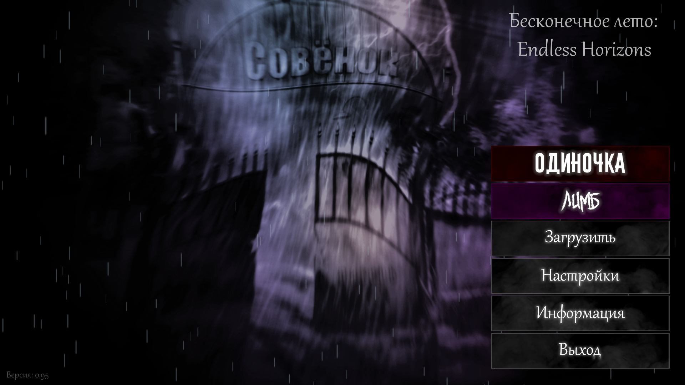
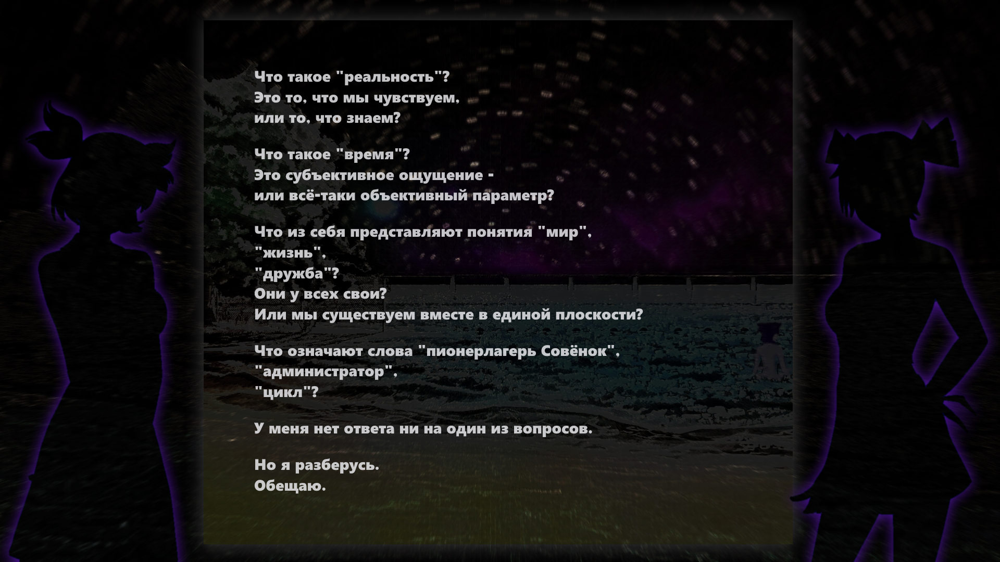
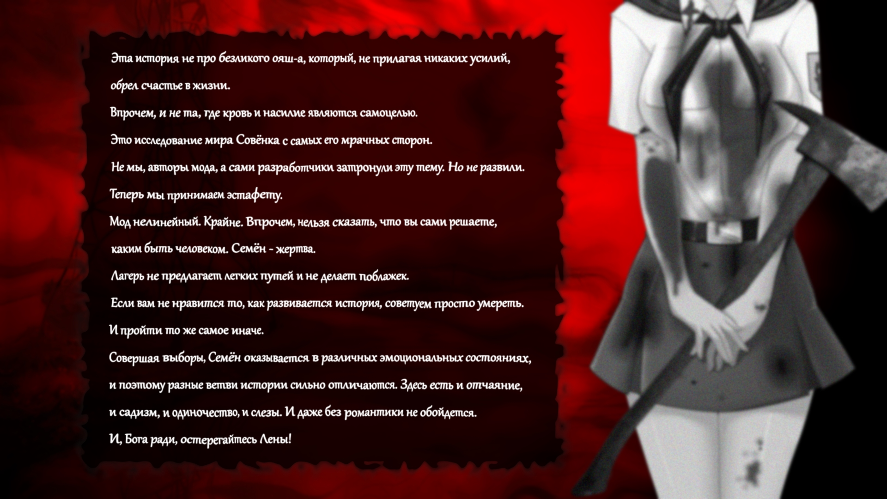
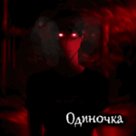
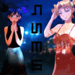
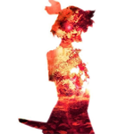

# Everlasting_Summer-EH_Compilation

### **Краткое описание**  :mega:
---
> Сборка двух модов Endless Horizons на базе Бесконечного лета с визуальными
добавлениями/изменениями и устранением мелких ошибок. Всё сделано ради удобства и нужной атмосферы <3

Версия игры на данный момент: 1.0

### **Список изменений** :hammer:
---
> - Добавлено своё "угрюмое" главное меню
> - Убрано/перерисовано __ВСЁ__ оригинальное GUI Бесконечного лета
> - Изменены иконки на логотип Endless Horizons
> - Добавлены трейлеры модификаций (по умолчанию включены)
> - Добавлена возможность выбрать старую музыку для одиночки (по умолчанию включено)
> - Исправлено отображение курсоров у модификаций
> - Убраны лишние настройки, которые могут отвлекать и вызывать ошибки

Клавиша "~" в главном меню позволяет откатиться к Бесконечному лету (не рекомендуется нажимать, может в будущем вылететь ошибка и слететь игровой GUI) :lock_with_ink_pen:

Для активации клавиши скачиваете и переносите [этот скрипт](https://drive.google.com/file/d/112-r1swg_bnNohRA1H2jRI08RNze7NXN/view?usp=share_link) в папку game

### **Скриншоты** :camera:
---

### **Ссылки** :link:
---

